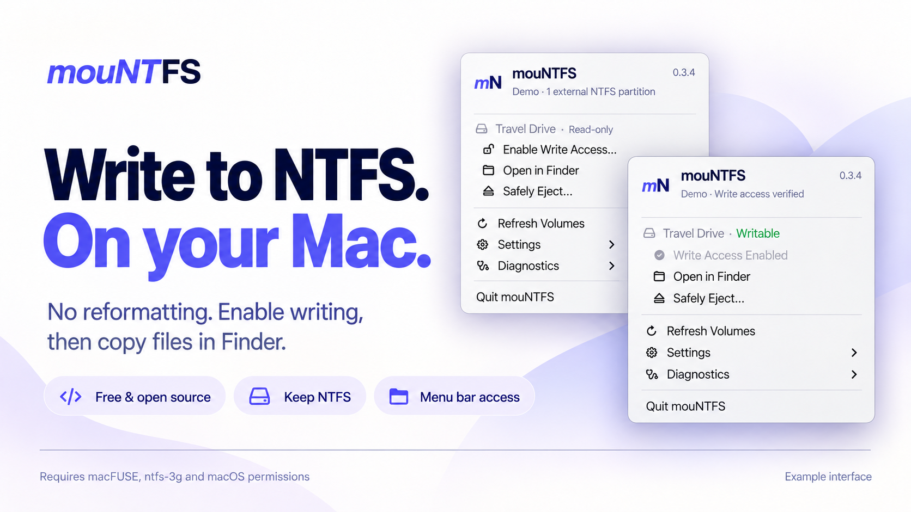

# *mouNT*FS

**English** · [简体中文](README.zh-CN.md)

[](LICENSE)
[](#humanai-collaboration)
[](https://mountfs.sh)

### Write to NTFS. On your Mac.

**Free & open source. Keep your drive's NTFS format.**

No reformatting. Enable writing from the menu bar, then copy files in Finder.
mouNTFS is a native Mac app for external NTFS drives, with a command-line core
that requires the bundled native identity tool for mounting.



*Illustrative artwork based on the app's English UI with sample drive data.
Requires separately installed drivers and macOS permissions.*

**Current version: 0.3.4 development build.** Requires separately installed macFUSE
and ntfs-3g. Development downloads are ad-hoc signed and not notarized.

[Get started](docs/USAGE.en.md) · [Downloads](https://github.com/guoquan/mountfs/actions) · [Roadmap](ROADMAP.md)

## See the app

| Select a drive | Write access enabled |
|---|---|
|  |  |

<details>
<summary>Operation progress and diagnostics</summary>

| Operation in progress | Copyable operation report |
|---|---|
|  |  |

</details>

These captures use the actual macOS app UI with **sample drive data and an example
log**. No disk was mounted to create them. The current UI is English.

## Your drive, your usual workflow

- **Keep NTFS.** Use your existing external drive without reformatting it.
- **Enable writing from the menu bar.** Select the drive, complete authorization
  and wait for mounting to finish.
- **Continue in Finder.** Copy, edit and organize files after writing is enabled;
  Finder opens by default after success.
- **Eject when finished.** Close files, then use the app's safe-eject action.

The app shows drive states and operation progress, refreshes the drive list
automatically and keeps troubleshooting reports available when needed. Connecting
a drive does not enable writing automatically. Initial setup requires compatible
drivers, system approval and disk-access permissions.

## Quick start

Requires macOS 13+, Homebrew and compatible drivers:

```bash
brew install --cask macfuse
brew install gromgit/fuse/ntfs-3g-mac
```

Follow the [macFUSE setup guide](https://github.com/macfuse/macfuse/wiki/Getting-Started)
for system approval and restart requirements. Download a successful macOS build
from [Actions](https://github.com/guoquan/mountfs/actions), extract the archive, and
place **mouNTFS.app** in Applications.

1. Connect the drive and open the mouNTFS menu.
2. Select **Enable Write Access…** and complete macOS authorization.
3. Wait for write verification; Finder opens by default.
4. Close files before **Safely Eject…**, which ejects the physical disk.

If macOS denies device access, check Full Disk Access for the actual **ntfs-3g**
executable. Administrator authorization is a separate permission.
[The usage guide](docs/USAGE.en.md) covers setup, updates and troubleshooting.
Experimental authorization settings are not required for the standard workflow.

## Safety and compatibility

mouNTFS targets external NTFS partitions, checks the selected device identity,
verifies writing as the current user and attempts same-volume read-only recovery
on failure. It does not force-unmount, clear Windows hibernation or format a drive.
Recovery can still fail; inspect diagnostics and Disk Utility if an operation fails.

Ordinary mounting has limited user-reported success on Apple Silicon. Other drive,
OS and driver combinations require further testing. See the [validation record](docs/VALIDATION.md)
for the evidence and remaining checks. FSKit remains experimental.

## Documentation

| For users | English | 简体中文 |
|---|---|---|
| Overview | [README](README.md) | [项目介绍](README.zh-CN.md) |
| Setup, use and troubleshooting | [Usage guide](docs/USAGE.en.md) | [使用说明](docs/USAGE.zh-CN.md) |

Development documentation is maintained in English:

- [Roadmap](ROADMAP.md): planned stages and acceptance criteria.
- [Authorization architecture](docs/AUTHORIZATION.md): permission helper, signing and Touch ID boundaries.
- [Validation record](docs/VALIDATION.md): CI, physical-Mac reports and remaining tests.
- [Contributing and documentation](CONTRIBUTING.md): local builds, checks and screenshot capture.

## Build and contribute

On macOS with Xcode Command Line Tools, from a checkout:

```bash
bash scripts/build-app.sh
open dist/mouNTFS.app
```

Download archives include a version number; the app stays **mouNTFS.app** so updates
can replace it. Quit the old app before replacing it. The separate website download
endpoint has not been updated by this development branch.

## Human–AI collaboration

> 🤝 An experiment in human–AI collaboration, co-developed with AI buddies.
> 🤖 AI writes the code; 👤 humans lead design, review, testing and direction.
> 🥳 From a shell script to a native Mac app — let's see where this ride goes.

The collaboration is part of the project’s identity: AI writes the code while
humans shape the product, review changes and test it in the real world.
Original collaborators: Claude 3.5 Sonnet, GPT-4o and [guoquan](https://guoquan.net).
The current development update was prepared with Codex. Contributions and safety
reviews are welcome.

MIT License © 2024–2026 Quan Guo.
