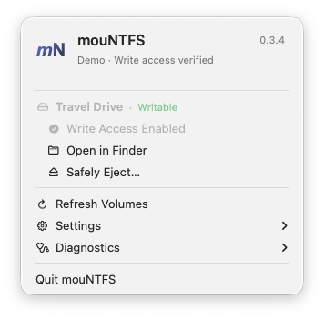
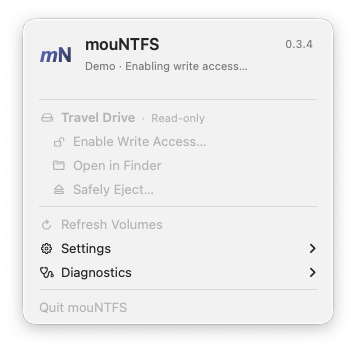
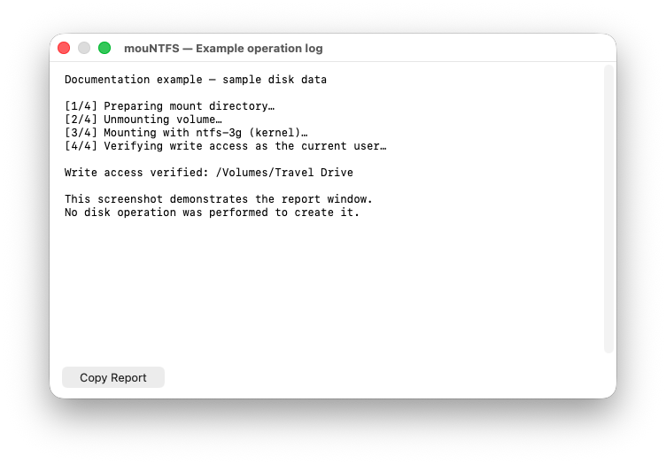

# *mouNT*FS

[English](README.md) · **简体中文**

[](LICENSE)
[](#人机协同开发)
[](https://mountfs.sh)

> 🤝 一场人机协同开发实验，和 AI 搭子一起做出来。
> 🤖 AI 写代码；👤 人类负责设计、审查、测试与方向。
> 🥳 从一个 Shell 脚本到原生 Mac 应用，看看这趟旅程还能走到哪里。

### 从 macOS 菜单栏管理你的 NTFS 磁盘

连接外置 NTFS 磁盘，启用写入，然后继续在 Finder 中使用。mouNTFS 现在提供原生菜单栏应用，可以直接查看磁盘状态、操作进度和可复制的诊断报告；独立 Shell 脚本仍保留供命令行使用。

**当前版本：0.3.4 开发版。** 需要单独安装 macFUSE 和 ntfs-3g。开发下载包使用 ad-hoc 签名，尚未公证。

[开始使用](docs/USAGE.zh-CN.md) · [下载构建](https://github.com/guoquan/mountfs/actions) · [后续计划](ROADMAP.md)

## 看看现在的应用

| 选择磁盘 | 写入已启用 |
|---|---|
|  |  |

<details>
<summary>操作进度与诊断报告</summary>

| 操作进行中 | 可复制的操作报告 |
|---|---|
|  |  |

</details>

截图来自实际 macOS 应用界面，使用**示例磁盘数据与示例日志**，生成截图时没有执行磁盘挂载。当前应用界面为英文。

## 使用体验有哪些变化

| 之前的脚本流程 | 现在的应用体验 |
|---|---|
| 在终端执行命令 | 从原生菜单选择磁盘 |
| 根据命令输出判断状态 | 每个磁盘旁直接显示只读或可写状态 |
| 操作时一直关注日志 | 显示进度，成功后安静完成，需要时再看日志 |
| 自己寻找挂载后的卷 | 验证成功后默认打开 Finder |
| 手动收集排查信息 | 提供磁盘扫描、安装诊断和可复制报告 |

应用也提供品牌图标、安全弹出确认、磁盘列表自动刷新，以及 Finder 打开和菜单栏磁盘计数选项。插入磁盘不会自动启用写入。

## 快速开始

需要 macOS 13 或以上、Homebrew 和兼容的驱动：

```bash
brew install --cask macfuse
brew install gromgit/fuse/ntfs-3g-mac
```

按 [macFUSE 安装指南](https://github.com/macfuse/macfuse/wiki/Getting-Started)完成系统批准和重启。从 [Actions](https://github.com/guoquan/mountfs/actions)下载成功的 macOS 构建，解压后将 **mouNTFS.app** 放入 Applications。

1. 连接磁盘，打开 mouNTFS 菜单。
2. 点击 **Enable Write Access…**，完成 macOS 授权。
3. 等待写入验证完成；默认随后打开 Finder。
4. 关闭使用中的文件，再点 **Safely Eject…**；这会弹出整块物理磁盘。

若 macOS 拒绝设备访问，检查实际 **ntfs-3g** 可执行文件的完全磁盘权限。管理员授权是另一项权限。[使用说明](docs/USAGE.zh-CN.md)包含安装、更新与故障处理。标准使用流程不需要配置实验授权选项。

## 安全与兼容性

mouNTFS 只对外置 NTFS 分区操作，核对所选设备身份，以当前用户验证写入，并在失败时尽力将同一个卷恢复为只读挂载。它不会强制卸载、清除 Windows 休眠状态或格式化磁盘。恢复仍可能失败；操作失败时请查看诊断和磁盘工具。

普通挂载已有有限的 Apple Silicon 使用反馈；其他磁盘、系统及驱动组合仍需继续测试。已测依据和待测项目见 [验证记录](docs/VALIDATION.md)。FSKit 仍是实验选项。

## 文档导航

| 用户文档 | English | 简体中文 |
|---|---|---|
| 项目介绍 | [README](README.md) | [项目介绍](README.zh-CN.md) |
| 安装、使用与故障处理 | [Usage guide](docs/USAGE.en.md) | [使用说明](docs/USAGE.zh-CN.md) |

开发类文档统一使用英文：

- [Roadmap](ROADMAP.md)：后续阶段和完成标准。
- [Authorization architecture](docs/AUTHORIZATION.md)：权限服务、签名和 Touch ID 边界。
- [Validation record](docs/VALIDATION.md)：CI、真实 Mac 反馈和待测项目。
- [Contributing and documentation](CONTRIBUTING.md)：本机构建、检查和截图生成。

## 构建与参与

在装有 Xcode Command Line Tools 的 macOS 上，进入项目目录：

```bash
bash scripts/build-app.sh
open dist/mouNTFS.app
```

下载包带版本号，应用保持 **mouNTFS.app** 名称以便覆盖更新；替换前先退出旧应用。本开发分支尚未更新独立网站的下载入口。

## 人机协同开发

协作方式也是这个项目的个性：AI 写代码，人类塑造产品、审查改动，并在真实环境中测试。

最初协作者：Claude 3.5 Sonnet、GPT-4o 和 [guoquan](https://guoquan.net)。当前开发更新由 Codex 协助完成。欢迎贡献和安全审查。

MIT License © 2024–2026 Quan Guo.
