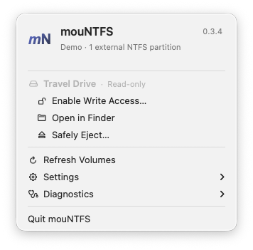

# Using mouNTFS

**English** · [简体中文](USAGE.zh-CN.md) · [Overview](../README.md)

mouNTFS is a macOS menu bar app that uses macFUSE and ntfs-3g to enable read/write
access to external NTFS partitions. Keep your drive's format, enable writing from
the menu bar, then continue in Finder. The app is free and open source.
Connecting a drive does not enable writing automatically. The app does not format drives.

The current version is **0.3.4, a development build**, not a notarized public release.
Use the steps below; experimental authorization settings in Settings are not needed.
Future features are described in the [roadmap](../ROADMAP.md).

## Install and update

Requires macOS 13+ and separately installed Homebrew, macFUSE and ntfs-3g-mac:

```bash
brew install --cask macfuse
brew install gromgit/fuse/ntfs-3g-mac
```

Follow the [macFUSE guide](https://github.com/macfuse/macfuse/wiki/Getting-Started)
for your OS's approval and restart requirements. The default kernel backend may
require system-extension approval and, on Apple Silicon, a startup security change
in Recovery. The app does not change those settings. FSKit is experimental and
has not completed physical-drive validation.

On [GitHub Actions](https://github.com/guoquan/mountfs/actions), choose a successful
build for the desired commit and download its development-app artifact. Inside the
artifact ZIP is a versioned archive, such as `mouNTFS-0.3.4-dev-arm64.zip`; extract
that archive to obtain the app.

- Downloads include version numbers so builds can be distinguished.
- The application is always **mouNTFS.app**, allowing replacement updates.
- Quit the old app, replace `/Applications/mouNTFS.app`, then open it there.
- The menu header shows the version. Downloads are ad-hoc signed development
  builds, not notarized public releases.

## Enable writing and eject



*Actual UI capture with sample drive data; no disk operation was performed.*

1. Connect an external NTFS drive and click the mouNTFS menu bar icon.
2. Check the partition name/state and choose **Enable Write Access…**.
3. Confirm the action and complete administrator authorization when macOS requests it.
4. Wait for verification. Finder opens after success by default; Settings can disable this.
5. Close files using the drive, then choose **Safely Eject…**. The confirmation
   applies to the physical disk, including its other partitions.

Operations show progress; successful completion does not open a log window.
Open **Diagnostics → Show Last Operation…** to inspect the log. The list refreshes
approximately every five seconds and on mount/unmount notifications. Insertion
updates the list without automatically enabling writing.

macOS requests administrator authorization when needed; prompt counts can vary.
The app does not save your password.

## Mounting permissions

| Permission | Purpose | Guidance |
|---|---|---|
| Administrator authorization | Run mount operations requiring elevated privileges | Follow the system dialog; this does not grant disk privacy access |
| Full Disk Access | Permit the relevant executable to access macOS privacy-controlled data/devices | If device access is denied, check the actual ntfs-3g path |

In the reported working environment, **ntfs-3g** Full Disk Access was sufficient
even with mouNTFS Full Disk Access disabled. Common paths:

```text
/opt/homebrew/bin/ntfs-3g
/usr/local/bin/ntfs-3g
```

Add the actual driver under **System Settings → Privacy & Security → Full Disk Access**.
Installation diagnosis reports the driver path. The app cannot confirm whether
macOS has granted permission. This observation comes from one environment;
requirements may differ on other systems.

## Troubleshooting

| Error or symptom | Next step |
|---|---|
| No partition appears after insertion | Open **Show Disk Scan Report…** and inspect exclusion reasons. Whole disks, internal disks and non-NTFS partitions are not mount targets |
| `DiskUUID=missing; VolumeUUID=missing` | Do not reformat solely for missing UUIDs; the app can use IOMedia connection identity. If identity cannot be established, the operation stops |
| `Error opening '/dev/disk…': Operation not permitted` | Check the actual ntfs-3g driver's Full Disk Access first. A subsequent generic unsafe-state hint alone does not establish Windows hibernation |
| `Unsupported macOS Version` | Follow macFUSE guidance to install a compatible version, approve it and restart |
| Mount reports success but writing cannot be verified | Read Show Details for the device, mount path, read-only flags and write-probe error; driver success alone does not establish write access |
| A confirmed hibernated/unclean NTFS error | Fully shut down or repair the volume in Windows; the app does not force writing or remove hibernation files |
| Unmount reports the drive is busy | Close programs using the drive and retry; the app does not force-unmount |

After failure, the app attempts to restore the same partition read-only through
macOS. It does not recover against a replacement if the device disappeared or
its identity changed. Busy mounts, authorization cancellation and OS errors can
prevent recovery. Check the log and Disk Utility; recovery is not guaranteed.

## Reporting a problem

Copy these items from Show Details or Diagnostics:

- App version, macOS, architecture, driver path and selected backend.
- Latest operation log, particularly the first specific error and verification state.
- Read-only disk scan and installation diagnosis.

Reports can contain volume names, paths or usernames; redact unnecessary personal
information before sharing. Device numbers such as `disk4s1` can change; do not
execute disk commands using an old number. See the [validation record](VALIDATION.md)
for the full tested/untested boundary.
